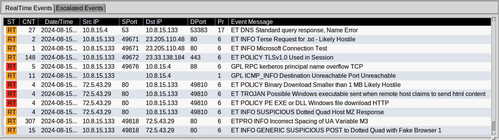
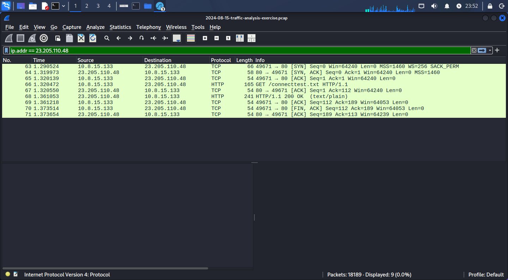
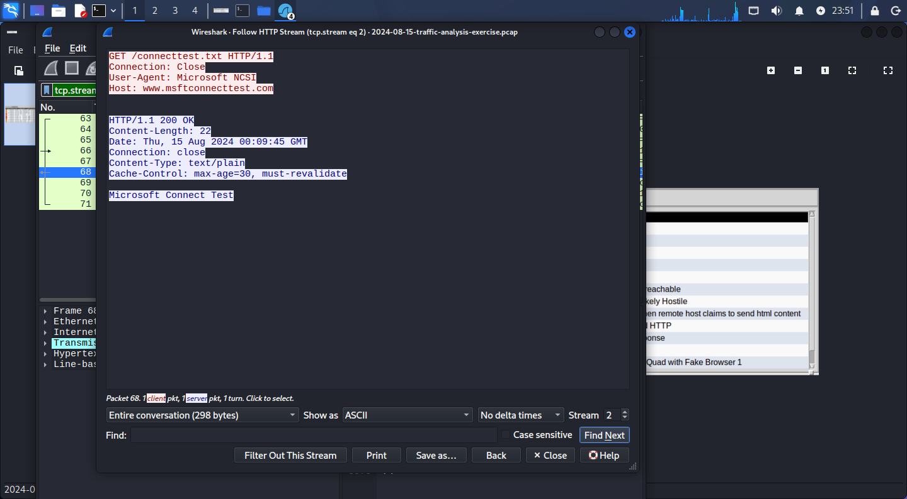
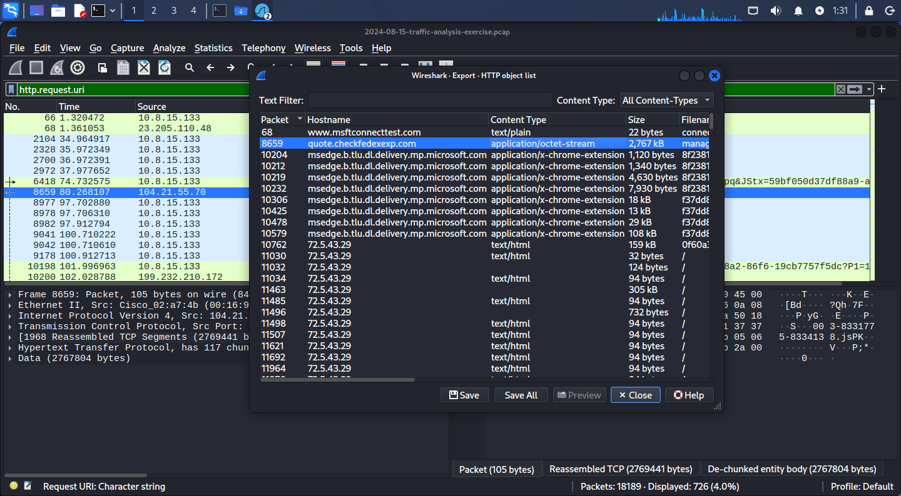
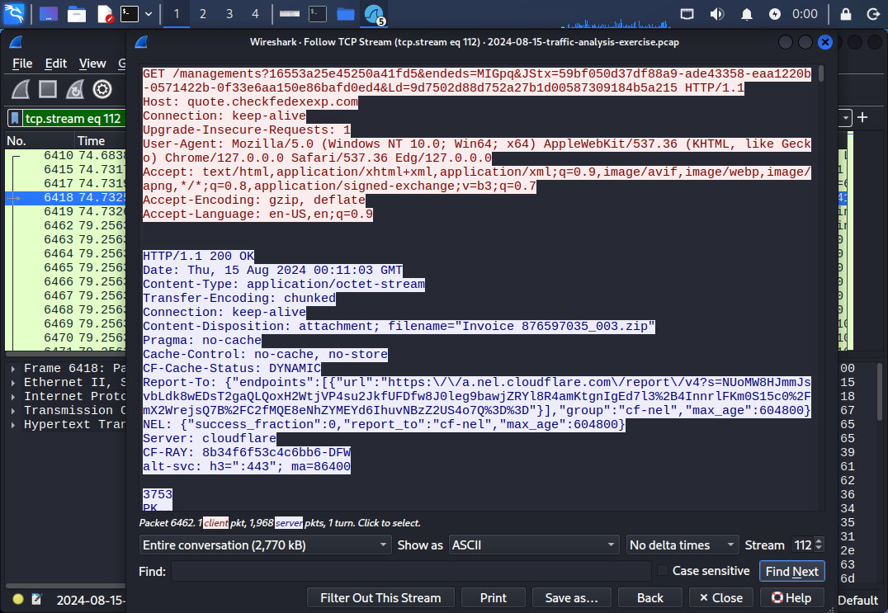
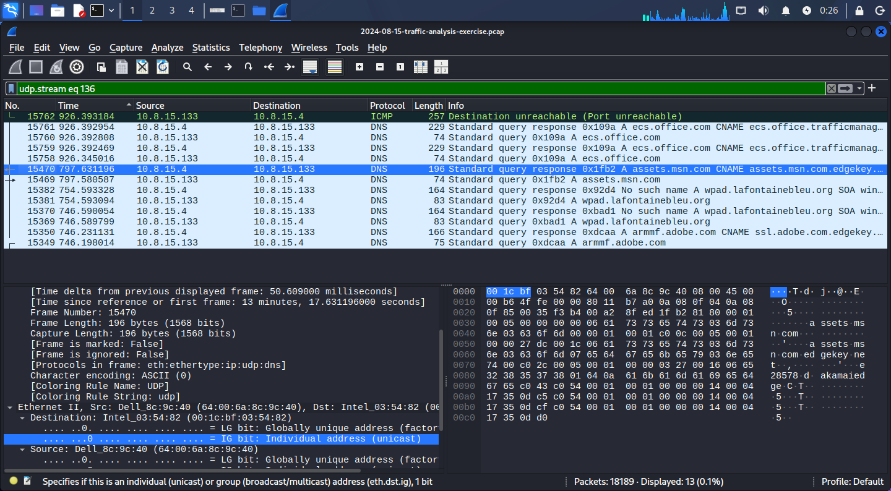
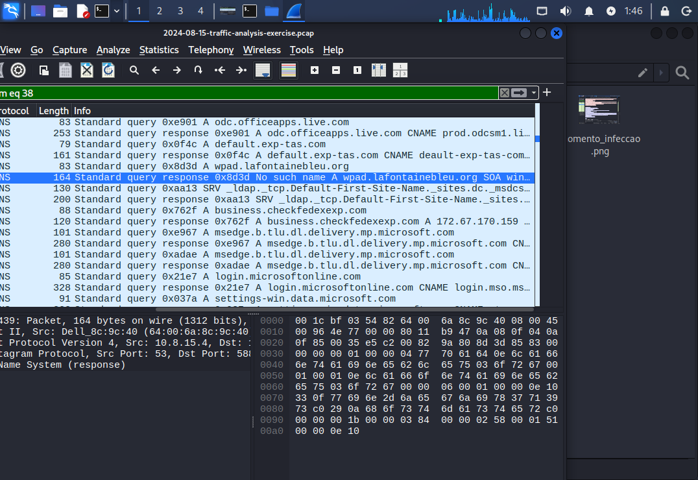
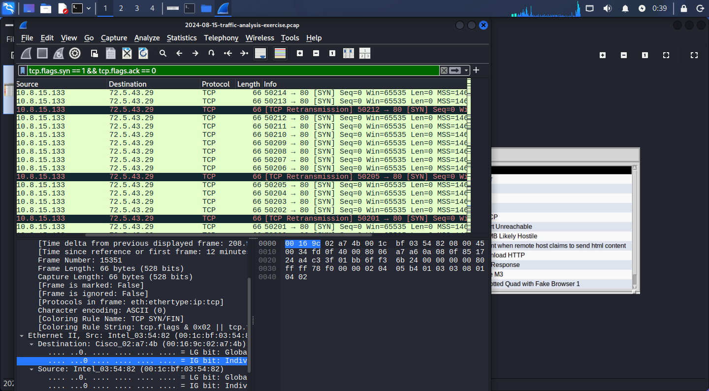
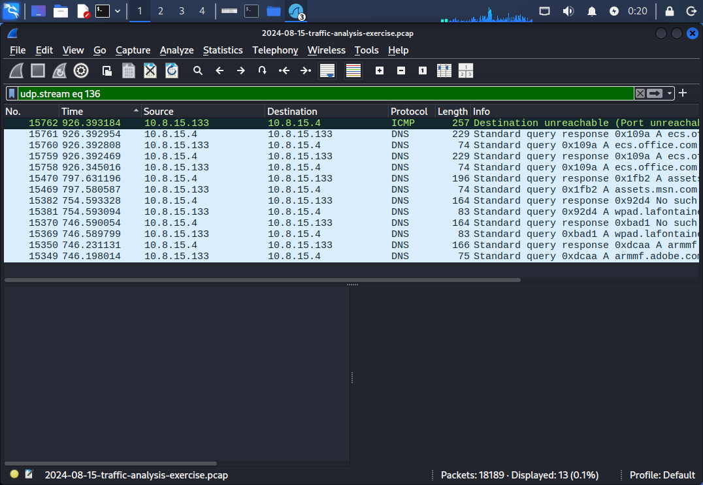

# 🍪 Análise de Tráfego: Malware WarmCookie

Repositório dedicado à análise forense de rede do backdoor WarmCookie, focado em identificar o vetor de ataque, indicadores de comprometimento (IoCs) e comportamento pós-infecção.

---

## 📌 Resumo Executivo

| Campo | Valor |
|---|---|
| **Paciente Zero** | `10.8.15.133` |
| **Arquivo Malicioso** | `Invoice_876597035_003.zip` (assinatura PK disfarçada de `.txt`) |
| **Host Suspeito** | `quote.checkfedexexp.com` — typosquatting da FedEx |
| **Técnica de Evasão** | Mascaramento de ZIP como TXT (Magic Bytes mismatch) |
| **C&C** | SYN anômalo + beaconing UDP para `72.54.43.29` |
| **Ambiente** | Captura em ambiente controlado (Sandbox) |

---

## 🛠️ Ferramentas Utilizadas

- Wireshark — inspeção profunda de pacotes
- Suricata/Snort Rules — correlação de alertas

---

## 🚨 Alertas

---

## 🕵️ Fluxo da Investigação

### Fase 1 — Reconhecimento e Vetor de Infecção

Filtro aplicado com base nos alertas: `ip.addr == 10.8.15.133`

Identificada requisição HTTP com `200 OK` para `connecttest.txt` — técnica usada para checar conectividade antes da infecção.

Via **HTTP Export Objects**, foi localizado o artefato malicioso: `Invoice_876597035_003.zip` disfarçado de `.txt`. A verificação no `tcp.stream eq 112` confirmou a assinatura `PK` — extensão spoofing.

---

### Fase 2 — Comportamento DNS e Camuflagem de Tráfego

O malware realizou consultas DNS para domínios legítimos (`adobe.com`, `office.com`) para camuflar sua atividade e testar conectividade.

Erro `NXDOMAIN` para `wpad.lafontainebleau.org` — tentativa de localizar proxy WPAD interno inexistente.

---

### Fase 3 — Tentativa de C2 e Movimentação Lateral

Filtro: `tcp.flags.syn == 1 && tcp.flags.ack == 0`

Identificado SYN Flood sem resposta ACK para `72.54.43.29` e ICMP tipo 3 (`port unreachable`) — indicando que o firewall bloqueou a comunicação externa e a movimentação lateral.

---

## ✅ Conclusão

A análise demonstrou o ciclo completo de comprometimento: entrega via extensão spoofing → execução → tentativa de C2 → movimentação lateral bloqueada pelo firewall.

> Este caso foi a motivação direta para o desenvolvimento do **[ExtCheck](https://github.com/Yakov021/projeto_ExtCheck)** — ferramenta Python de detecção de spoofing de extensões via Magic Bytes.
